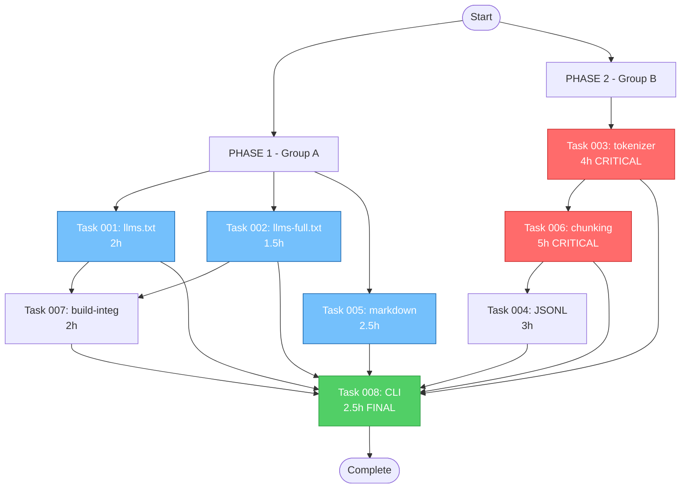

# Task Dependency Graph - Jot LLM Export



## Color Legend

- 🔵 **Blue**: Parallel Group A (can run simultaneously)
- 🔴 **Red**: Critical Path (sequential, blocking)
- 🟢 **Green**: Final Integration (depends on all)

---

## Dependency Matrix

| Task | Depends On | Blocks | Parallel Group | Phase |
|------|------------|--------|----------------|-------|
| 001  | -          | 007, 008 | A | 1 |
| 002  | -          | 007, 008 | A | 1 |
| 003  | -          | 006, 008 | B | 2 |
| 004  | 006        | 008    | C | 3 |
| 005  | -          | 008    | A | 1 |
| 006  | 003        | 004, 008 | B | 2 |
| 007  | 001, 002   | 008    | D | 4 |
| 008  | ALL        | -      | E | 5 |

---

## Critical Path Analysis

**Longest Sequential Chain:**
```
Task 003 (4h) → Task 006 (5h) → Task 004 (3h) = 12 hours
```

**Shortest Possible Duration:**
```
Max(
  Task 001 + Task 007 = 4h,
  Task 002 + Task 007 = 3.5h,
  Task 005 = 2.5h,
  Task 003 + Task 006 + Task 004 = 12h ← CRITICAL PATH
) + Task 008 = 14.5 hours total
```

---

## Gantt Chart (ASCII)

```
Hour    0    2    4    6    8    10   12   14   16
        |    |    |    |    |    |    |    |    |
001     [====]
002     [===]
005     [=====]
                  [===================================]
                  |---------- PHASE 2 CRITICAL -------|
003               [========]
006                         [==========]
004                                    [======]
007          [====]
008                                              [=====]
```

---

## Parallel Execution Groups

### Group A (Start immediately, 3 agents)
- Task 001 (llms.txt)
- Task 002 (llms-full.txt)
- Task 005 (markdown)

### Group B (Sequential, 1 agent - CRITICAL)
- Task 003 (tokenizer) THEN Task 006 (chunking)

### Group C (After Group B, 1 agent)
- Task 004 (JSONL)

### Group D (After Tasks 001 & 002, 1 agent)
- Task 007 (build integration)

### Group E (After ALL, 1 agent)
- Task 008 (CLI updates)

---

## Optimal Agent Allocation

**Scenario 1: Unlimited Agents**
- 3 agents on Group A (parallel)
- 1 agent on Group B (critical path)
- 1 agent on Group C (waiting for B)
- 1 agent on Group D (waiting for A)
- 1 agent on Group E (final)

**Total:** 7 agents, 14.5 hours

**Scenario 2: Limited to 3 Agents**
- Agent 1: Task 001 → Task 007 → Task 008
- Agent 2: Task 002 (idle) → Task 005 (idle) → (wait for 008)
- Agent 3: Task 003 → Task 006 → Task 004 → (wait for 008)

**Total:** 3 agents, ~18 hours

**Scenario 3: Single Agent (Sequential)**
- All tasks in dependency order
- Total: 22.5 hours

---

## Bottleneck Analysis

**Primary Bottleneck:** Task 003 (tokenizer)
- Blocks: Task 006, which blocks Task 004
- Critical path starts here
- Cannot be parallelized

**Secondary Bottleneck:** Task 008 (CLI)
- Depends on ALL previous tasks
- Cannot start until everything else complete
- Acts as synchronization point

**Recommendation:**
- Assign most experienced developer to Tasks 003 & 006
- Start Group A tasks immediately to unblock Task 007
- Keep Task 008 developer ready for final integration

---

## Risk Analysis

**High Risk:**
- Task 003 delay cascades to 006 → 004 → 008
- Tokenizer library compatibility issues
- Go module dependency conflicts

**Medium Risk:**
- Task 008 integration issues requiring rework
- Test failures in chunking strategies
- Config file schema breaking changes

**Low Risk:**
- Group A tasks are independent
- Markdown/llms.txt are simple formats
- Well-defined specifications available

---

## Validation Checkpoints

**After Phase 1:**
- [ ] llms.txt files generate correctly
- [ ] Markdown export preserves formatting

**After Phase 2:**
- [ ] Tokenizer produces accurate counts
- [ ] Chunking strategies work with tokenizer
- [ ] All tests pass

**After Phase 3:**
- [ ] JSONL format is valid
- [ ] Streaming ingestion works

**After Phase 4:**
- [ ] `jot build` auto-generates llms.txt
- [ ] Build doesn't break existing functionality

**After Phase 5:**
- [ ] All CLI flags work
- [ ] Help text is accurate
- [ ] Presets configure correctly

---

**Last Updated:** 2025-10-21
**Total Tasks:** 8
**Critical Path:** 12 hours (Tasks 003 → 006 → 004)
**Optimal Duration:** 14.5 hours with parallelization
